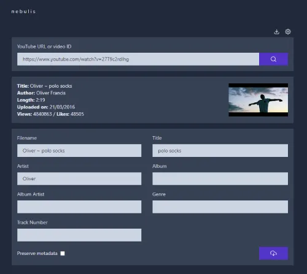
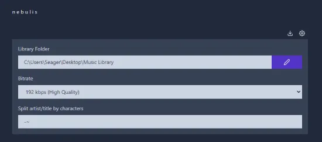

### n e b u l i s

Windows app to download YouTube MP3s with MetaData editing

## To do

- Production build .exe
- Checkboxes in preferences for metadata fields
- Adjust start and end times
- Write unit tests (which frameworks? WebDriverIO, mocha, jest? needs to work with typescript, react & electron. How to test multiple OS for ffmpeg?)

## Bugs

- Bug when there's a special character in name "Nu:tone"
- convertSecondstoMintues zero padding bug

# Setup Dev environment

1. clone repo
2. npm install
3. npm run watch
4. npm run start
